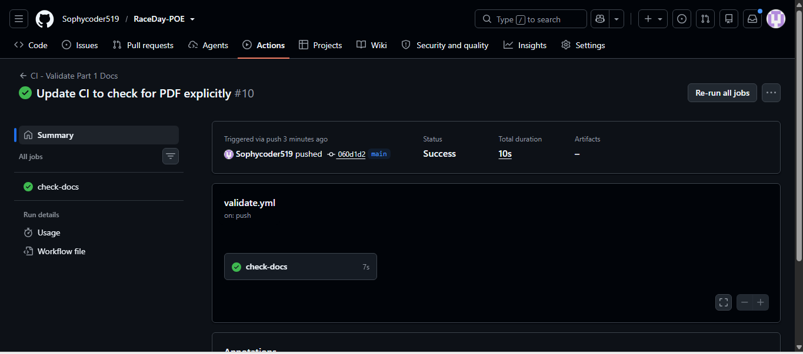

# RaceDay Event Management System - Part 1

## System Overview
RaceDay is a full-stack event management platform for the South African road running, walking, and cycling community.

## Roles
- **Organiser**: Creates events, manages categories, captures results, and views enrolments.
- **Participant**: Browses events, enters events, and tracks personal results.

## Project Structure
- `/docs/erd.png` - Entity Relationship Diagram
- `/docs/endpoint-plan.md` - API endpoint specification
- `/docs/script.sql` - SQL schema and seed data
- `/.github/workflows/validate.yml` - CI/CD workflow

## Database Setup
1. Open SSMS and run `docs/script.sql` against the `ST10479223` database.

## CI/CD Status

## Video Presentation
[Watch the walkthrough here](https://youtu.be/your-link-here)

## AI Disclosure
This planning was drafted with the assistance of an AI tool for structuring and brainstorming. All final decisions were personally reviewed and implemented.